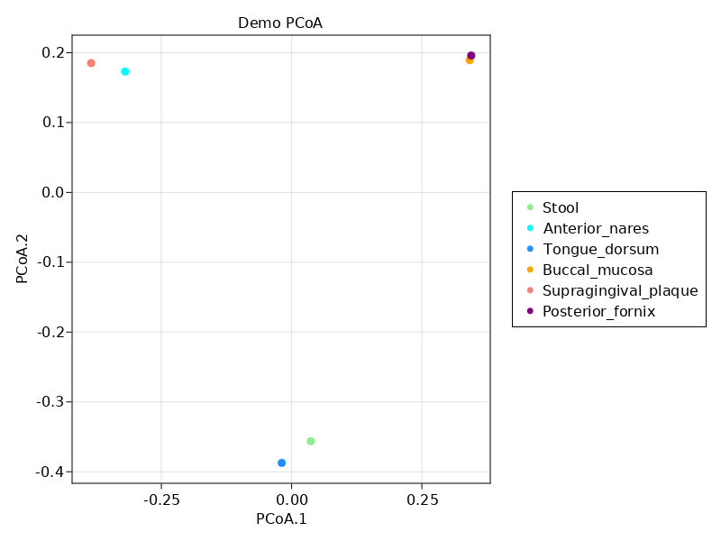
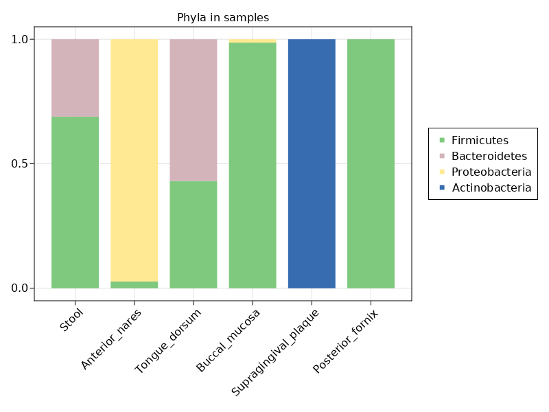

```@meta
CurrentModule = BiobakeryUtils
```
# [MetaPhlAn Tutorial with BiobakeryUtils.jl](@id metaphlan-tutorial)


- 🗒️ This tutorial mirrors the [official MetaPhlAn tutorial](https://github.com/biobakery/biobakery/wiki/metaphlan3)
- ❓️ If you have questions about MetaPhlAn itself, please direct them to the [bioBakery help forum](https://forum.biobakery.org/c/Microbial-community-profiling/MetaPhlAn)
- 🤔 If you have questions about using the MetaPhlAn tools in julia, [please open an issue](https://github.com/EcoJulia/BiobakeryUtils.jl/issues/new/choose),
  or start a discussion over on [`Microbiome.jl`](https://github.com/EcoJulia/Microbiome.jl/discussions/new)!
- 📔 For a function / type reference, [jump to the bottom](#Functions-and-Types)

This tutorial assumes:

1. You have activated a julia Project that has `BiobakeryUtils.jl` installed
2. The `metaphlan` python package is installed and accessible from your `PATH`
   (see the [bioBakery installation guide](https://github.com/biobakery/MetaPhlAn/wiki/MetaPhlAn-4#installation))

## Loading MetaPhlAn output

You can load a MetaPhlAn profile using [`metaphlan_profile`](@ref):

```julia-repl
julia> mp = metaphlan_profile("SRS014476-Supragingival_plaque_profile.tsv"; sample="SRS014476")
CommunityProfile{Float64, Taxon, MicrobiomeSample} with 11 features in 1 samples

Feature names:
Bacteria, Actinobacteria, Actinobacteria...Corynebacterium_matruchotii, Rothia_dentocariosa

Sample names:
SRS014476
```

This generates a [`CommunityProfile`](@ref Microbiome.CommunityProfile) type from Microbiome.jl,
which is a matrix-like object with [`MicrobiomeSample`](@ref Microbiome.MicrobiomeSample)s
as column headers,
and [`Taxon`](@ref Microbiome.Taxon)s as row headers.

The samples can be accessed with [`samples`](@ref Microbiome.samples)
or [`samplenames`](@ref Microbiome.samplenames):

```julia-repl
julia> samples(mp)
1-element Vector{MicrobiomeSample}:
 MicrobiomeSample("SRS014476", {})

julia> samplenames(mp)
1-element Vector{String}:
 "SRS014476"
```

Notice that in addition to the sample name ("SRS014476"),
there's an additional field - that's a metadata dictionary
that we can add values to.

```julia-repl
julia> plaque = first(samples(mp))
MicrobiomeSample("SRS014476", {})

julia> set!(plaque, :STSite, "Supragingival Plaque")
MicrobiomeSample("SRS014476", {:STSite = "Supragingival Plaque"})
```

The taxa (Microbiome.jl uses the generic term "features") can be accessed
with [`features`](@ref Microbiome.features)
or [`featurenames`](@ref Microbiome.featurenames):

```julia-repl
julia> features(mp)
11-element Vector{Taxon}:
 Taxon("Bacteria", :kingdom)
 Taxon("Actinobacteria", :phylum)
 Taxon("Actinobacteria", :class)
 Taxon("Corynebacteriales", :order)
 Taxon("Micrococcales", :order)
 Taxon("Corynebacteriales", :order)
 Taxon("Micrococcales", :order)
 Taxon("Corynebacteriaceae", :family)
 Taxon("Micrococcaceae", :family)
 Taxon("Corynebacterium", :genus)
 Taxon("Rothia", :genus)
 Taxon("Corynebacterium_matruchotii", :species)
 Taxon("Rothia_dentocariosa", :species)
```

## [Merging profiles](@id metaphlan-multi)

To merge profiles from multiple samples, you can load each individual profile
as a `CommunityProfile` and merge them with [`commjoin`](@ref Microbiome.commjoin):

```julia-repl
julia> mps2 = commjoin([metaphlan_profile(p) for p in profiles]...)
CommunityProfile{Float64, Taxon, MicrobiomeSample} with 62 features in 6 samples

Feature names:
Bacteria, Firmicutes, Bacteroidetes...Lactobacillus_crispatus, Lactobacillus_iners

Sample names:
SRS014459-Stool_profile, SRS014464-Anterior_nares_profile, SRS014470-Tongue_dorsum_profile...SRS014476-Supragingival_plaque_profile
, SRS014494-Posterior_fornix_profile
```

You can also load a pre-merged table (eg from `merge_metaphlan_tables.py`) using
[`metaphlan_profiles`](@ref):

```julia-repl
julia> mps = metaphlan_profiles("merged_abundance_table.tsv"; samplestart=3)
CommunityProfile{Float64, Taxon, MicrobiomeSample} with 62 features in 6 samples

Feature names:
Bacteria, Actinobacteria, Actinobacteria...Moraxella, Moraxella_nonliquefaciens

Sample names:
SRS014494-Posterior_fornix, SRS014476-Supragingival_plaque, SRS014472-Buccal_mucosa...SRS014464-Anterior_nares, SRS014459-Stool
```

Note: the `samplestart=3` argument is necessary when the second column contains NCBI taxonomy IDs.

One benefit of building the merged table in julia is that as we're loading the tables,
we can attach metadata to them.
For example:

```julia-repl
julia> my_profiles = [] # an empty vector
Any[]

julia> for p in profiles
           file_wo_ext = first(splitext(p))
           (srs, site) = split(file_wo_ext, '-')
           site = replace(site, "_profile"=> "")

           sample = MicrobiomeSample(srs)
           set!(sample, :STSite, site)
           set!(sample, :filename, p)
           push!(my_profiles, metaphlan_profile(p; sample))
       end

julia> mps3 = commjoin(my_profiles...)
CommunityProfile{Float64, Taxon, MicrobiomeSample} with 62 features in 6 samples

Feature names:
Bacteria, Firmicutes, Bacteroidetes...Lactobacillus_crispatus, Lactobacillus_iners

Sample names:
SRS014459, SRS014464, SRS014470...SRS014476, SRS014494


julia> get(mps3)
6-element Vector{NamedTuple{(:sample, :STSite, :filename), Tuple{String, String, String}}}:
 (sample = "SRS014459", STSite = "Stool", filename = "SRS014459-Stool_profile.tsv")
 (sample = "SRS014464", STSite = "Anterior_nares", filename = "SRS014464-Anterior_nares_profile.tsv")
 (sample = "SRS014470", STSite = "Tongue_dorsum", filename = "SRS014470-Tongue_dorsum_profile.tsv")
 (sample = "SRS014472", STSite = "Buccal_mucosa", filename = "SRS014472-Buccal_mucosa_profile.tsv")
 (sample = "SRS014476", STSite = "Supragingival_plaque", filename = "SRS014476-Supragingival_plaque_profile.tsv")
 (sample = "SRS014494", STSite = "Posterior_fornix", filename = "SRS014494-Posterior_fornix_profile.tsv")
```

[See Microbiome.jl docs](https://docs.ecojulia.org/Microbiome.jl/latest/profiles/#working-metadata-1) for more info on metadata and `CommunityProfile`s)

## Analyze Results

With the profile loaded, you can use many julia packages to analyze or visualize the results.
Inside the `CommunityProfile` is a sparse matrix,
which you can access with [`abundances`](@ref Microbiome.abundances).
This means that all of julia's powerful statistics and ML libraries
are easy to use with your microbiome data.

For more information about indexing and accessing components of the data,
see [the Microbiome.jl docs](https://docs.ecojulia.org/Microbiome.jl/latest/profiles/#Indexing-and-selecting-1)

### Performing PCoA analysis

To demonstrate this, we'll use a couple of other julia packages
to perform and plot a principal coordinates analysis (PCoA):
[`Distances.jl`](https://github.com/JuliaStats/Distances.jl) and [`MulitvariateStats.jl`](https://github.com/JuliaStats/MulitvariateStats.jl).

(Actually some convenient functions for this are re-exported from `Microbiome.jl`
eg [`braycurtis`](@ref Microbiome.braycurtis) and [`pcoa`](@ref Microbiome.pcoa)
-- this is just meant to show how easy it is to use the underlying data for whatever you like)

```julia-repl
julia> using MultivariateStats, Distances

julia> dm = pairwise(BrayCurtis(), abundances(mps3), dims=2)
6×6 Matrix{Float64}:
 0.0       0.853268  0.662373  0.758712  0.857143  0.758712
 0.853268  0.0       0.845517  0.841645  0.857143  0.845517
 0.662373  0.845517  0.0       0.77874   0.857143  0.787196
 0.758712  0.841645  0.77874   0.0       0.857143  0.461648
 0.857143  0.857143  0.857143  0.857143  0.0       0.857143
 0.758712  0.845517  0.787196  0.461648  0.857143  0.0

julia> pc = fit(MDS, dm, distances=true)
Classical MDS(indim = NaN, outdim = 5)
```

For plotting, I use [Makie](https://github.com/JuliaPlots/Makie.jl),
but there are [many other options](https://juliahub.com/ui/Search?q=plotting&type=packages).

```julia-repl
julia> using CairoMakie

julia> sites = [m.STSite for m in get(mps3)]
6-element Vector{String}:
 "Stool"
 "Anterior_nares"
 "Tongue_dorsum"
 "Buccal_mucosa"
 "Supragingival_plaque"
 "Posterior_fornix"

julia> clrs = [:lightgreen, :cyan, :dodgerblue, :orange, :salmon, :purple]

julia> loads = sqrt.(pc.λ)' .* projection(pc)

julia> fig, ax, plt = scatter(loads[:,1], loads[:, 2], color=clrs,
                              axis=(
                                  xlabel="PCoA.1",
                                  ylabel="PCoA.2",
                                  title="Demo PCoA"
                              ))

julia> leg = Legend(fig[1,2], [MarkerElement(color = c, marker=:circle) for c in clrs], sites)

julia> fig
```



### Stacked bar

One more example - let's plot the proportion of different phyla in each sample.
First, we'll filter the table to keep only rows that contain phyla.
The [`filter`](@ref Microbiome.filter) acts on a `CommunityProfile`
by applying the predicate to the `feature`s of the profile.

```julia-repl
julia> phyl = filter(t-> taxrank(t) == :phylum, mps3)
CommunityProfile{Float64, Taxon, MicrobiomeSample} with 4 features in 6 samples

Feature names:
Firmicutes, Bacteroidetes, Proteobacteria, Actinobacteria

Sample names:
SRS014459, SRS014464, SRS014470...SRS014476, SRS014494
```

```julia-repl
julia> phylumnames = featurenames(phyl)
4-element Vector{String}:
 "Firmicutes"
 "Bacteroidetes"
 "Proteobacteria"
 "Actinobacteria"

julia> fig2 = Figure()

julia> ax2 = Axis(fig2[1,1], title="Phyla in samples", xticks=(1:nsamples(phyl), sites));

julia> ax2.xticklabelrotation = π / 4
0.7853981633974483

julia> y = Float64[]

julia> for sample in samples(phyl)
           abs = abundances(phyl[:, sample])
           abs = abs ./ sum(abs)
           append!(y, abs)
       end

julia> x = repeat(1:nsamples(phyl), inner=nfeatures(phyl))

julia> sitenums = repeat(1:nfeatures(phyl), outer=nsamples(phyl))

julia> barplot!(ax2, x, y, stack=sitenums,
               color=sitenums, colormap=:Accent_5)

julia> leg = Legend(fig2[1,2], [MarkerElement(color = c, marker=:rect) for c in to_colormap(:Accent_5, 4)], phylumnames)

julia> fig2
```



## Functions and Types

```@autodocs
Modules = [BiobakeryUtils]
Pages = ["metaphlan.jl"]
```

[^note]: Right now, the table contains all taxonomic levels, so the PCoA doesn't make much sense. For a real analysis, you'd probably want to restrict to a single rank (eg species): `spec = filter(t-> taxrank(t) == :species, mps3)`.
